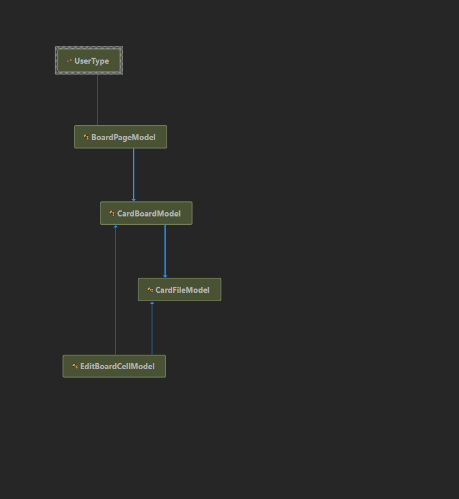
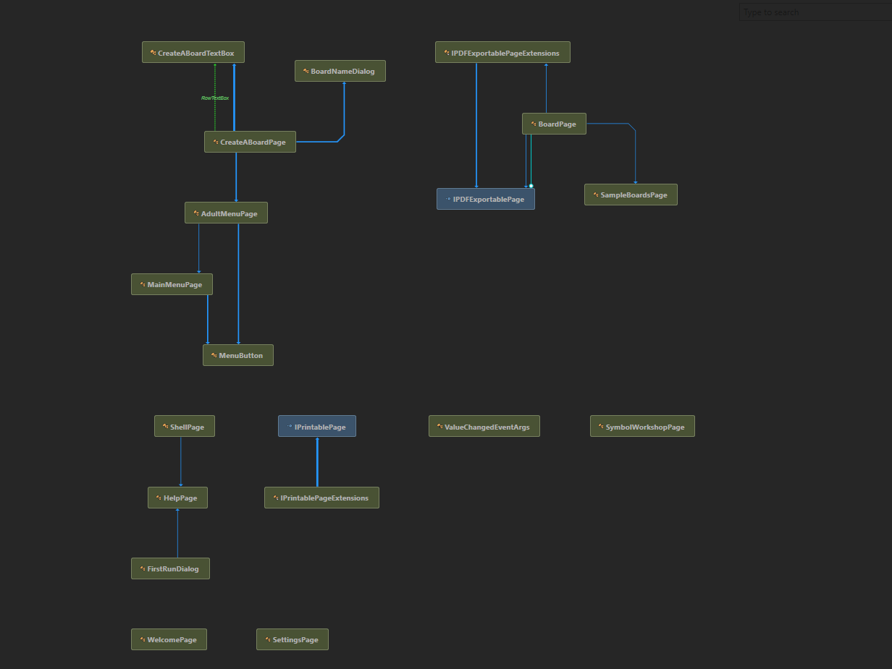
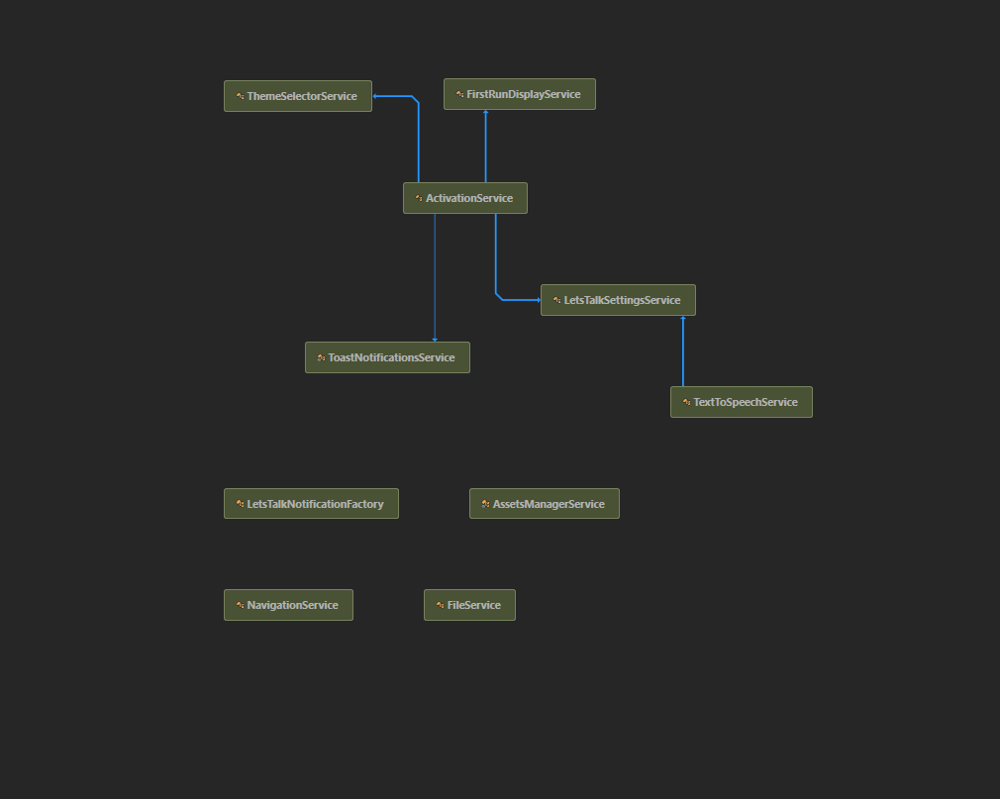

<a href="../../README.md"> Back</a>

 

<h1>Type Diagrams</h1>

<h2> Visual Studio Viewer</h2>

 If you install ReSharper to Visual Studio, you can right-click on any file or folder, and click <b>Show Type dependency Diagram</b>.

 Using the viewer let's you see the relationships between classes, the dependencies between them, and, if you hover over a box you will see the usages of that type too.

For now, here are some images of the diagrams

<h3>Let's Talk Project</h3>

<h4>ViewModels</h4>

<h4>Models</h4>

<h4> Pages</h4>

<h4> Services</h4>

 

<a href="../../README.md"> Back</a>
